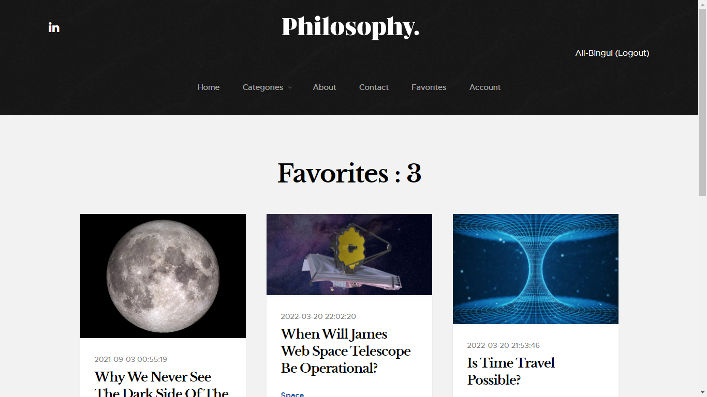

# Content Management System

I started this project during my internship at [IdeaSoft Yazılım](https://www.ideasoft.com.tr/). 

In this project, I created an MVC framework from scratch to understand how a web framework work.

---

## Installation

1. Clone the project using git
2. Create a database named "cms"
3. Create .env file from .env.example
4. Run `composer install`
5. Run `php migrations.php` command from the project root directory to run migrations.
6. Go to the public folder with command: `cd public`
7. Start PHP server by running command: `php -S 127.0.0.1:8080`
8. Open in browser [http://127.0.0.1:8080](http://127.0.0.1:8080) or [http://localhost:8080](http://localhost:8080)

---

* Member can add posts to their favorites.

* Members can subscribe to get an email when a new post is available.

---

### Admin

* Admin can edit, delete and make posts passive.

* Create a new post.

* Admin can reply and delete comments.

* Admin can delete members and send email to them.

* When a new post is created, an email sends to every subscriber.

* Admin update account.

* Admin login.

